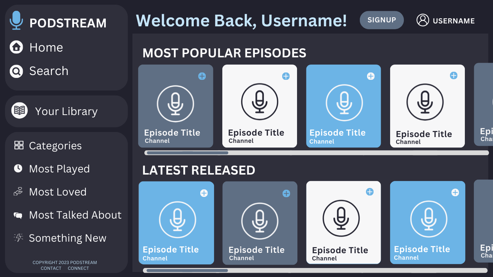
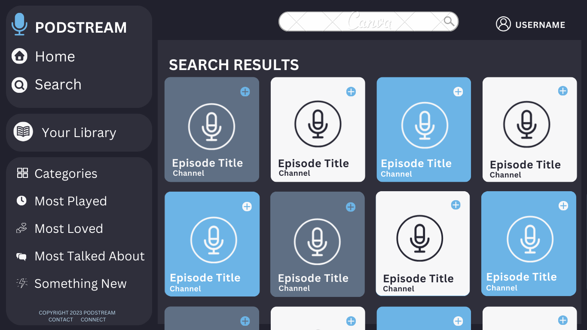
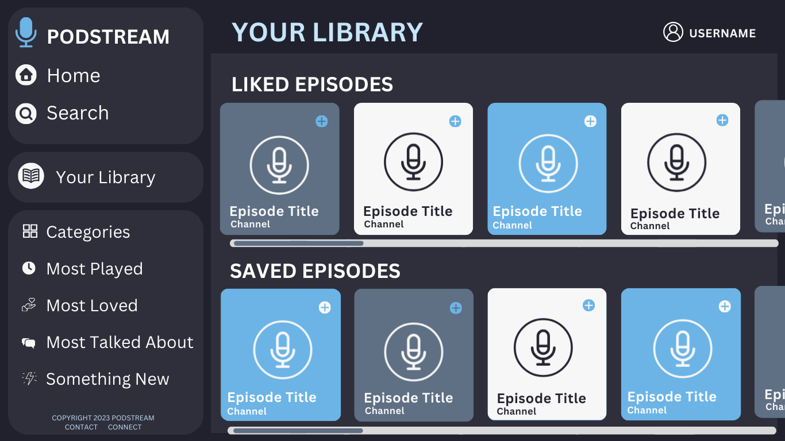
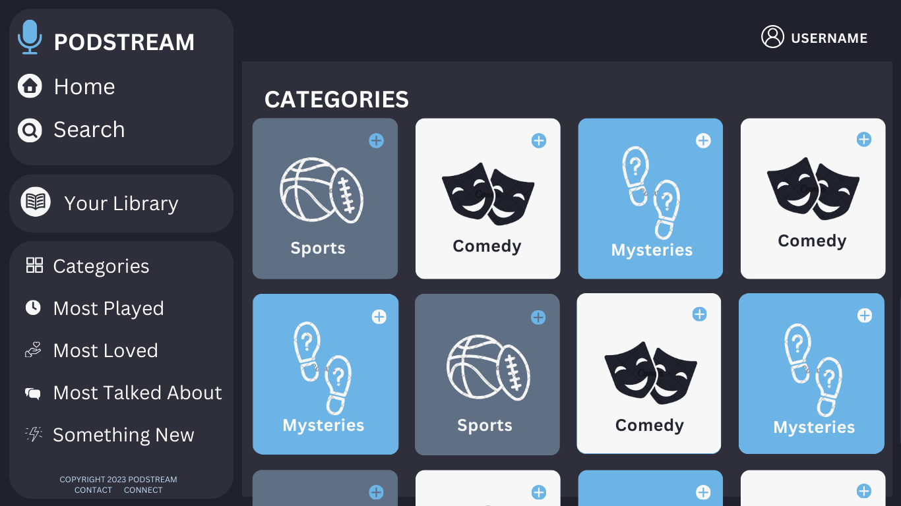
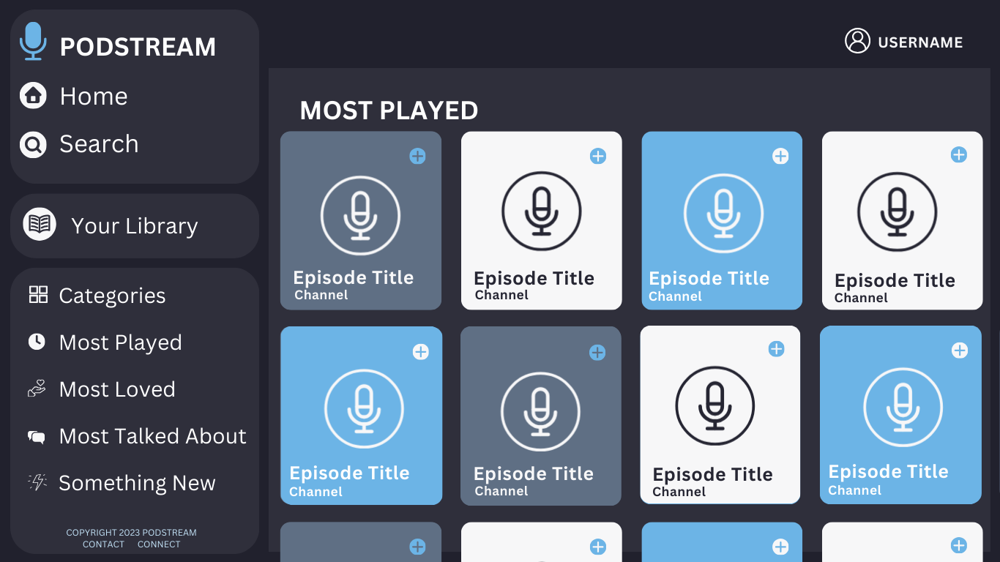
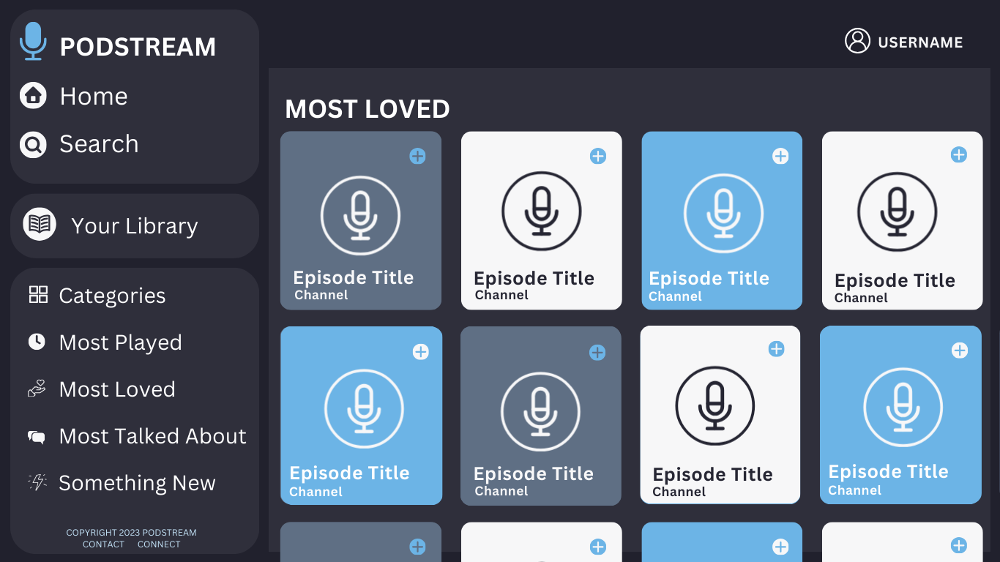
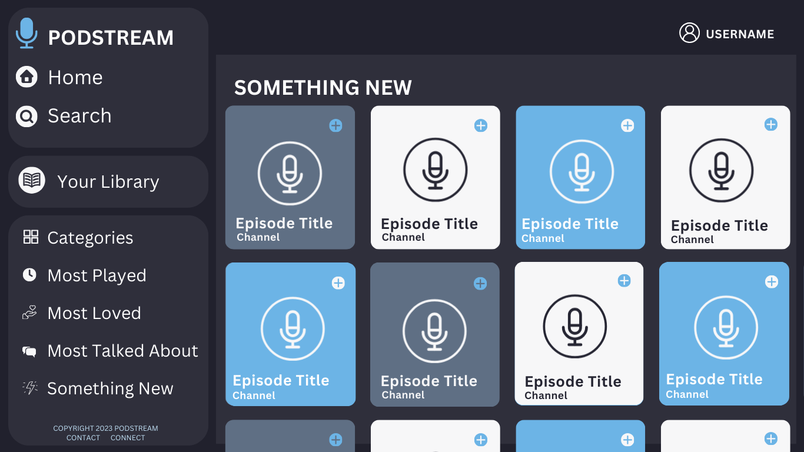
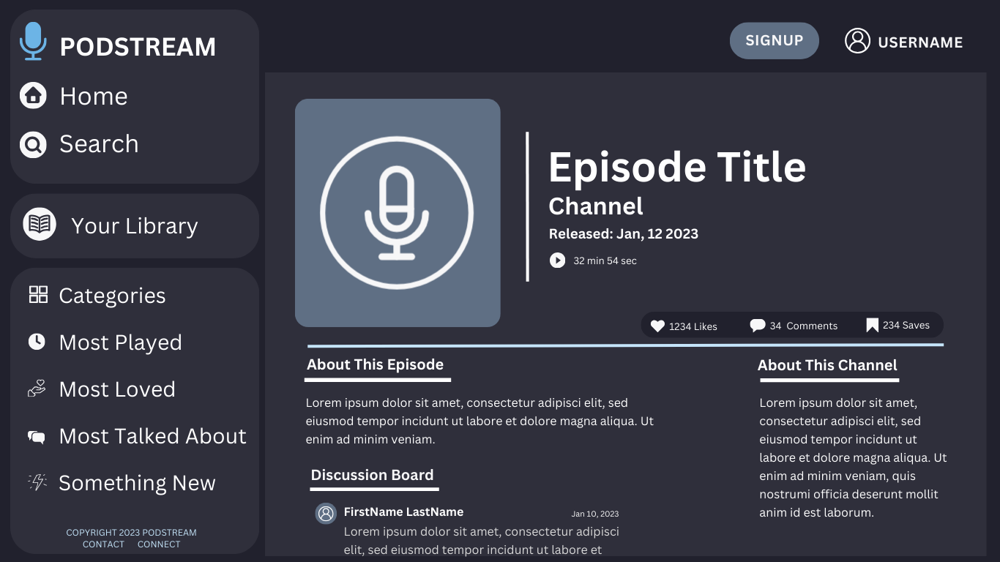

# PodCast Capstone

## Overview
A digital platform that enables users to discover, stream, and download audio episodes on various topics. Users add likes, saves and comments to their favorite episodes. The app provides a diverse range of content, catering to individual interests and preferences.

### Problem

The current platforms host podcasts but there isnt an app that specializes in the users experience specifically connecting you with content and other users experiences.

### User Profile

Caters to diverse audiences, including anyone on-the-go, commuters, students, and those who prefer content in audible format. This app prioritizes a user-friendly design, user accessibility features, and integrates the abilities to like, save, and add comments to their favorite content.

### Features

Content discovery, content interactions, content engagement

### Tech Stack

Node.js, Express.js, MySQL, React.js, Knex.js

### APIs

MySQL Database & episode data from spotify embeds

### Sitemap

Homepage with suggestions, a personal page with commented on episodes
<EpisodePage />
<HomePage />
<SearchPage />
<YourLibraryPage />
<CategoriesPage />
<SelectCategoryPage />
<MostPlayedPage />
<MostLovedPage />
<MostCommentedPage />
<SomethingNewPage />

### Mockups

## Nice-to-haves

I would love to set up a subscribe ability, and allow users to listen offline, options for content creators to upload and manage podcasts. Push notifications, subscription management, episode streaming and downloading, more social media integration,  in app customer support chat, login & encryption, AI driven playlist suggestions based on user preferences and listening history, option for continuous playback. Stripe API for user payment

## Future Plans

Firebase login, track users liked and saved episodes in mysql, have the Episode page do the axios POST request so the comments display automatically without page refresh, design a mobile layout, track episode plays and display a most played page, add recommended episodes on search page before beginning to search for results, filter episodes from categories prev commented on (eventually based on like and save count), exclude episodes already commented(liked, saved, played) and show the most recent relevant episodes per user, something new page filters out episodes user has already interacted with. 