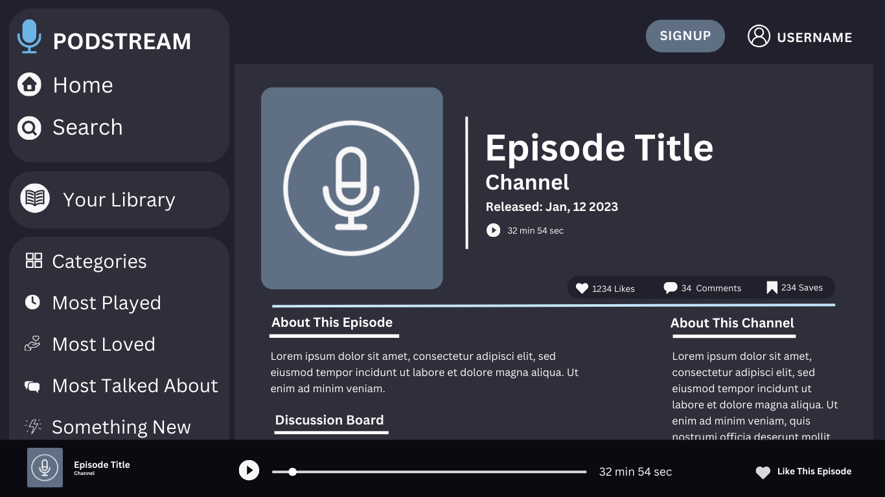

# PodCast Capstone

## Overview
A digital platform that enables users to discover, stream, and download audio episodes on various topics. Users can create playlists, and add likes to their favorite episodes. The app provides a diverse range of content, catering to individual interests and preferences.

### Problem

The current platforms contain podcasts but not one app that specializes in the users experience specifically connecting you with content and other users.

### User Profile

Caters to diverse audiences, including anyone on-the-go, commuters, students, and those who prefer content in audible format. This app prioritizes a user-friendly design, user accessibility features, and integrates the abilities to like, share comments and their favorite content with others.

### Features

User registration, user profiles, content discovery, playback controls.

### Tech Stack

Node.js, express.js, MySQL,  Json web tokens, passport.js, React.js 

### APIs

Firebase, spotify API, apple podcasts API

### Sitemap

Login page, Homepage with suggestions or recently listened to, a personal page with most recently liked, profile/settings page
<SearchBar />
<Header />
<PodcastList />
<MediaPlayer />
<UserAuthentication />
<UserFavorites />
<UserSavedPlaylists />
<Footer />

### Mockups

## Nice-to-haves

I would love to set up a subscribe ability, and allow users to listen offline, options for content creators to upload and manage podcasts. Push notifications, subscription management, episode streaming and downloading, social media integration,  in app customer support chat, data storage & encryption, AI driven playlist suggestions based on user preferences and listening history, option for continuous playback. Stripe API for user payment